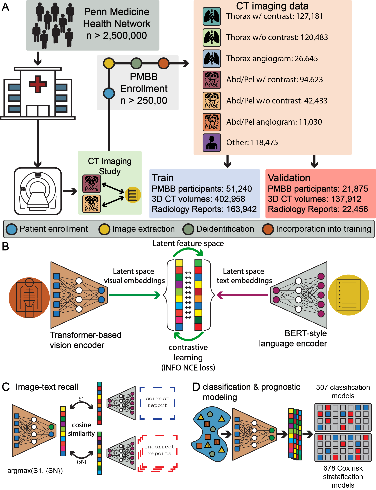

# Percival
Code repository for Percival: a generalizable vision language foundation model for computed tomography




## Diagnosis with Percival
```python
projection_dim = 512
king_percival = percival(in_channels=config.in_channels, 
                         projection_dim=projection_dim, 
                         img_size=(128, 256, 256))
device = torch.device("cuda" if torch.cuda.is_available() else "cpu")
king_percival.to(device)
king_percival.load_image_encoder(path=img_weights)
diagnostic_results = king_percival.diagnostic_inference_all_conditions(img_path=test_img_path, device=device)

```
## Available diagnostic models
| Diagnosis    | Phecode        | 5-fold AUROC  |
| :---         |     :---:      |          ---: |
| Heart failure   | 428.2     | 0.79 (0.76, 0.82)    |
| git diff     | git diff       | git diff      |