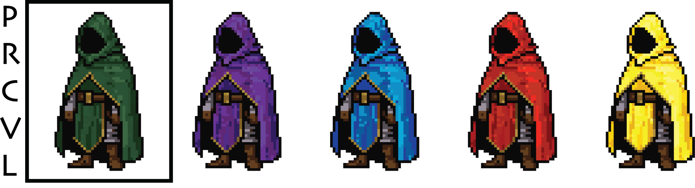
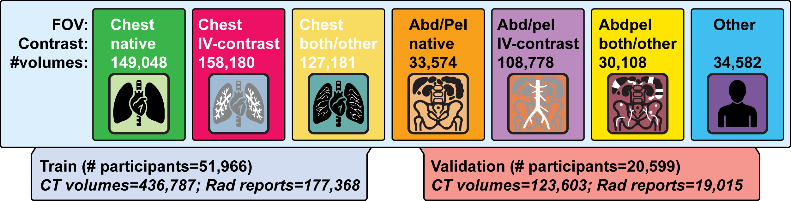
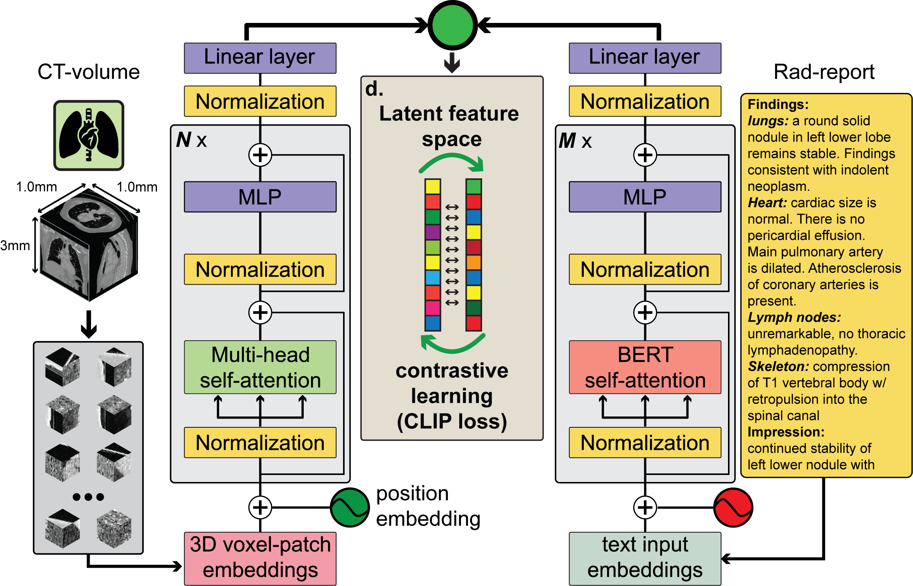

<p align="center">
  
</p>

<h1 align="center">Percival</h1>

<p align="center">
  <strong>Bridging Vision and Language Across 3D CT at Scale - 400K Volumes, 50K Patients, One Model</strong>
</p>

<p align="center">
  <a href="https://www.medrxiv.org/content/10.1101/2025.07.03.25330654v4"></a>
  <a href="https://doi.org/10.1101/2025.07.03.25330654"></a>
  <a href="https://huggingface.co/cbeeche/percival"></a>
  <a href="LICENSE"></a>
</p>

<p align="center">
  
  
  
  
</p>

---

Percival is a 3D vision-language foundation model for computed tomography (CT), trained on **400,000+ CT-report pairs** from **50,000+** Penn Medicine BioBank participants. The model learns aligned image and text representations via CLIP-style contrastive learning on full 3D CT volumes paired with radiology reports, enabling zero-shot classification, **per-code disease phenotyping**, **prognostic risk stratification**, and representation learning across anatomical regions.

<p align="center">
  
</p>

## 🆕 News

| Date | Update |
|---|---|
| **2026-05** | v2.0: ViT AugReg backbones (T/S/B) with CXR-BERT text encoder; LPS-standardized orientation; per-ICD-code linear-probe classifiers (702 CHEST + 624 ABD_PEL) and Cox PH prognostic models (1,149 CHEST + 1,159 ABD_PEL) ship in `inference/`; unified `InferenceModel` API serves both heads from one Percival forward pass |
| **2025-07** | v1.0: Initial release with DeiT-Small + Clinical Longformer, medRxiv preprint published |

## 🏰 Percival Model Family

| Model | Vision Encoder | Text Encoder | Params | Weights |
|---|---|---|---:|---|
| Percival-T | ViT-AugReg Tiny  | CXR-BERT | ~6M  | [🤗 HF](https://huggingface.co/cbeeche/percival/tree/main/tiny) |
| Percival-S | ViT-AugReg Small | CXR-BERT | ~22M | [🤗 HF](https://huggingface.co/cbeeche/percival/tree/main/small) |
| Percival-B | ViT-AugReg Base  | CXR-BERT | ~86M | [🤗 HF](https://huggingface.co/cbeeche/percival/tree/main/base) |

Param counts are for the **vision tower** only; the language tower adds ~110M (CXR-BERT) and is shared across all three sizes.

## 🩺 Downstream heads (per-ICD-code, frozen Percival embeddings)

Two task heads ship in `inference/`. Each row in each CSV is one trained per-(ICD code, region) model fit on the 768-dim Percival vision-tower output.

| Region   | Diagnostic (logistic linear probe) | Prognostic (Cox PH) |
|---|---:|---:|
| CHEST    | 702 codes  | 1,149 codes |
| ABD_PEL  | 624 codes  | 1,159 codes |

- **Diagnostic** - per-code `StandardScaler` + L1 logistic regression (glmnet, unbalanced) + Youden's-J operating threshold. Probabilities are calibrated to true per-code prevalence.
- **Prognostic** - per-code ridge Cox proportional-hazards on raw embeddings (no scaler, no L2, no intercept) + linear-predictor cutoff (top-20% on val) + event-rate enrichment.

## 🔀 Pipeline

```
   raw CT (.nii.gz)
        │
        │ nifti_to_pt.py
        ▼
   resampled volume (.pt)
        │
        │ extract_embeddings.py
        ▼
   per-scan embedding (.pt, 768-dim)
        │
        │ perform_inference.py   (or InferenceModel from your own script)
        ▼
   per-code outputs:
        ├── diagnostic  → probability + high-risk call per ICD code
        └── prognostic  → log hazard ratio + high-risk call per ICD code
```

Pre-converting NIfTI → PT once is **~8× faster** than reading from `.nii.gz` at training / inference time:

| Stage | mean per scan |
|---|---:|
| PT loading    | 0.16 s |
| NIfTI loading | 1.29 s |

## 🚀 Quick Start

### Installation

```bash
conda env create -f environment.yml -n percival
conda activate percival
```

**Requirements:** Python 3.10+, PyTorch 2.9+ with CUDA 12.8 wheels, CUDA-capable GPU (CPU works but is slow).

The shipped `environment.yml` is **one** reference environment we've tested end-to-end - not a hard requirement. Any conda/pip setup satisfying the version constraints above will run the model; bring your own environment if you already have one. We pin `environment.yml` for reproducibility, not exclusivity.

Verify the install:

```bash
python -c "from train_operations.percival import Percival; print('imports OK')"
```

### Feature Extraction

```bash
# Single NIfTI in, embedding out (one command, on-the-fly resampling)
python extract_embeddings.py \
    --nifti-path scan.nii.gz \
    --weights /path/to/visual_epoch_<N>_loss_<L>.pth \
    --config configs/augreg_base_v0.yaml \
    --output scan_embedding.pt
```

Or via Python:

```python
import torch
from extract_embeddings import build_percival, load_from_nifti, embed_volume

device = torch.device("cuda")
model  = build_percival("configs/augreg_base_v0.yaml",
                        "/path/to/visual_epoch_<N>_loss_<L>.pth", device)
img    = load_from_nifti("scan.nii.gz", image_size_xyz=(352, 352, 128))
emb    = embed_volume(model, img, device).squeeze().cpu().numpy()   # (768,)
```

### Inference (diagnostic + prognostic)

Both task heads live behind one object - `InferenceModel` - that builds Percival once and scores every per-(ICD code, region) model from a single forward pass.

```python
from train_operations.inference_model import InferenceModel

model = InferenceModel(img_weights="/path/to/visual_epoch_<N>_loss_<L>.pth")

# Diagnostic (logistic, per-code probabilities)
df_d, summary_d = model.diagnostic_inference_all_conditions(img_path="scan.nii.gz")

# Prognostic (Cox PH, per-code log hazard ratios)
df_p, summary_p = model.prognostic_inference_all_conditions(img_path="scan.nii.gz")
```

Embed once, score both heads (faster than two separate calls):

```python
emb = model.embed("scan.nii.gz")
df_d, _ = model.diagnostic_inference_all_conditions(embedding=emb)
df_p, _ = model.prognostic_inference_all_conditions(embedding=emb)
```

**Output schemas (one row per ICD code):**

| Head | Columns |
|---|---|
| Diagnostic | `code, region, prob, high_risk, youden_thresh, note` |
| Prognostic | `code, region, lp, hazard_ratio, high_risk, high_risk_threshold, enrichment` |

Single-region variants (`diagnostic_inference(..., region="CHEST")` and `prognostic_inference(..., region="ABD_PEL")`) score just one region with the same return signature.

## 📋 Data Format

Training expects a JSON annotation file with patient-study-scan hierarchy:

```json
[
  {
    "patient_id": "patient_001",
    "studies": [
      {
        "study_id": "study_001",
        "study_date": "2024-01-15",
        "scans": [
          {
            "scan_id": "scan_001",
            "image_path": "/path/to/scan.nii.gz",
            "pt_path": "/path/to/scan.pt",
            "report_path": "/path/to/report.txt",
            "full_report": "Findings: ..."
          }
        ]
      }
    ]
  }
]
```

Inference (embedding extraction + classification) accepts xlsx manifests with `pt_path` and/or `nifti_path` columns, or single files via `--pt-path` / `--nifti-path`.

Supported image formats: NIfTI (`.nii.gz`) or pre-converted PyTorch tensors (`.pt`). The NIfTI → PT preprocessing (LPS reorient, trilinear resample to `(3.0, 1.0, 1.0)` mm, HU clamp to `[-1000, 1000]`) lives in `nifti_to_pt/nifti_to_pt.py` and runs inside `extract_embeddings.py` for on-the-fly NIfTI inference.

## 🏋️ Training

### Configuration

Training is configured via YAML files. Configs ship for three AugReg variants in `configs/`:

```yaml
model:
  vision_model_size: base        # tiny | small | base
  vision_pretrain: augreg        # augreg | mae | deit
  language_model: microsoft/BiomedVLP-CXR-BERT-specialized
  projection_dim: 768
  image_size: [352, 352, 128]
  patch_size: [8, 16, 16]

training:
  epochs: 16
  batch_size: 48
  learning_rate: 5.0e-5
  use_amp: true
  distributed: true
```

### Launch Training

Single node, multi-GPU:

```bash
accelerate launch --num_processes 4 --mixed_precision fp16 \
    train.py --config configs/augreg_base_v0.yaml
```

SLURM cluster:

```bash
sbatch run_train.sh                                  # defaults to augreg_base_v0
sbatch run_train.sh configs/augreg_small_v0.yaml     # any variant
```

## 🧱 Supported backbones

### Vision Backbones

| Backbone | Pretrained Source | Sizes |
|---|---|---|
| ViT AugReg | ImageNet-21K (augmentation + regularization) | Tiny, Small, Base |
| ViT MAE | ImageNet-1K (masked autoencoder) | Small, Base, Large |
| ViT DeiT | ImageNet-1K (data-efficient training) | Tiny, Small, Base |

All 2D pretrained weights are automatically inflated to 3D during initialization.

### Text Encoders

| Encoder | Max Tokens | Domain |
|---|---|---|
| CXR-BERT | 512 | Chest X-ray reports |
| Clinical Longformer | 4,096 | Clinical notes |
| BioViL-T | 512 | Biomedical text |

## 🏛️ Architecture

<p align="center">
  
</p>

Percival consists of two towers trained with symmetric InfoNCE (CLIP) contrastive loss:

- **Vision Tower** - 3D Vision Transformer with 2D-to-3D weight inflation. Patch embedding converts `(1, D, H, W)` CT volumes into patch token sequences. Supports AugReg, MAE, and DeiT pretrained initializations.

- **Language Tower** - Pretrained clinical text encoder (CXR-BERT, Clinical Longformer, or BioViL-T) with a linear projection to the shared embedding space. CLS-token pooling.

- **Contrastive Loss** - Distributed CLIP loss with all-gather across GPUs. Temperature-scaled symmetric cross-entropy over the cosine-similarity matrix.

All CT volumes are standardized to **LPS orientation** during preprocessing.

## 📄 Citation

If you use Percival in your research, please cite:

```bibtex
@article{Beeche2025Percival,
  author = {Beeche, Cameron and Kim, Joonghyun and Tavolinejad, Hamed and Zhao, Bingxin and Sharma, Rakesh and Duda, Jeffrey and Gee, James and Dako, Farouk and Verma, Anurag and Morse, Colleen and Hou, Bojian and Shen, Li and Sagreiya, Hersh and Davatzikos, Christos and Damrauer, Scott and Ritchie, Marylyn D. and Rader, Daniel and Long, Qi and Chen, Tianlong and Kahn, Charles E. and Chirinos, Julio and Witschey, Walter R. and Penn Medicine Biobank},
  title = {A Pan-Organ Vision-Language Model for Generalizable 3D CT Representations},
  journal = {medRxiv},
  year = {2025},
  doi = {10.1101/2025.07.03.25330654},
  url = {https://www.medrxiv.org/content/10.1101/2025.07.03.25330654v4}
}
```

## 🙏 Acknowledgments

We gratefully acknowledge the contributions of:

- [Penn Medicine BioBank (PMBB)](https://pmbb.med.upenn.edu/) for providing the training data
- [Merlin](https://github.com/StanfordMIMI/Merlin) and [CT-CLIP](https://github.com/ibrahimethemhamamci/CT-CLIP) for foundational work in 3D medical VLMs
- [CT-RATE](https://huggingface.co/datasets/ibrahimhamamci/CT-RATE) for the external validation dataset
- [timm](https://github.com/huggingface/pytorch-image-models) for pretrained vision transformer implementations
- [Hugging Face Transformers](https://github.com/huggingface/transformers) for text encoder infrastructure

## ⚖️ License

This project is licensed under the **Creative Commons Attribution-NonCommercial 4.0 International (CC BY-NC 4.0)** license - see [LICENSE](LICENSE) for details. Free for research and educational use; commercial use requires a separate agreement.
